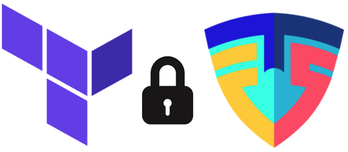

# Priorisant la Sécurité dans le Cloud avec TFSec : Analyse Automatisée des Vulnérabilités Terraform dans le Pipeline CI/CD avec GitHub Actions.

Cet article a pour objectif d'automatiser l'analyse du code Terraform et est structuré comme suit :
- Une brève explication de TFSec, GitHub Actions et Terraform.
- CI/CD déployé pour recevoir et effectuer l'analyse.
- Ajouter les éléments IaC est proposé comme une continuité.

## Vue d'ensemble

La sécurité de l'information est fondamentale dans tout environnement technologique, et son rôle devient encore plus critique dans le contexte de l'infrastructure cloud. Voici quelques points clés sur l'importance de la sécurité de l'information dans ce contexte :

- Protection des données sensibles
- Conformité aux réglementations
- Gestion des accès et des identités
- Détection et réponse aux menaces
- Résilience et continuité des activités

Par conséquent, ce projet consiste en une analyse automatique des déclarations IaC pour AWS afin de trouver des vulnérabilités à corriger. De plus, cette analyse suggère des bonnes pratiques dans la provision des éléments d'infrastructure déclarés.

## IaC: Concept et outil
Infrastructure as Code ou Infraestrutura como Código. C'est, comme son nom l'indique, la gestion et le provisionnement de l'infrastructure à travers du code. Cette action remplace les processus manuels. Terraform est l'un des outils disponibles pour l'IaC.

Terraform est un outil conçu pour construire, modifier et versionner l'infrastructure. Par conséquent, ce n'est ni un langage ni un framework, mais plutôt une ressource utilisée dans le cadre du DevOps pour garantir plus d'agilité et de sécurité dans les déploiements.

Avec Terraform, le DevOps devient plus efficace, en particulier en utilisant les bonnes pratiques de cet outil. D'ailleurs, il devrait figurer sur la liste des compétences de tout développeur travaillant dans ce domaine. Découvrez ci-dessous quelques avantages de cette ressource : 

- Configuration rapide et économique de l'environnement de test ;
- Possibilité de choisir le meilleur fournisseur, comme AWS, Google Cloud, Azure, entre autres ;
- Reproduction continue et facile de l'environnement ;
- Réduction des coûts ;
- Meilleure efficacité et sécurité.

## CI/CD: Intégration de GitHub Actions pour l'automatisation.

Dans le contexte de l'IaC/Terraform, un pipeline est un processus automatisé qui permet un développement, des tests et un déploiement efficaces et contrôlés de l'infrastructure cloud, garantissant la conformité aux meilleures pratiques de développement et de sécurité.

Dans ce contexte, GitHub Actions est un outil qui permet de créer des pipelines CI/CD directement sur GitHub, facilitant l'automatisation des tâches telles que les tests, la compilation et le déploiement de code.

## TFSec: Analyse statique de Terraform

TFSec est un outil de sécurité pour l'infrastructure en tant que code (IaC) qui aide à identifier les problèmes de sécurité potentiels et les bonnes pratiques dans les configurations d'infrastructure définies par le code. Il est spécialement conçu pour fonctionner avec Terraform, un outil populaire d'automatisation de l'infrastructure de HashiCorp.

TFSec vérifie les fichiers de configuration Terraform à la recherche de modèles connus de vulnérabilités, de configurations non sécurisées et d'erreurs courantes qui pourraient compromettre la sécurité de l'infrastructure. Il fournit une liste de recommandations et d'alertes pour aider les utilisateurs à corriger ces problèmes avant de déployer leur infrastructure dans le cloud.

Certaines des vérifications effectuées par TFSec incluent :

- Les mots de passe ou les clés d'accès intégrés dans le code.
- Les configurations de permissions excessives ou inadéquates sur les ressources cloud.
- Les défauts dans la configuration de la cryptographie et de la sécurité du réseau.
- L'exposition de données sensibles.
- Les configurations réseau mal définies pouvant entraîner des failles de sécurité.

Utiliser TFSec comme partie intégrante du processus de développement et de déploiement de l'infrastructure aide les équipes à s'assurer que leurs configurations sont conformes aux meilleures pratiques de sécurité, réduisant ainsi le risque de violations de sécurité et de fuites de données.

## Technologies Utilisées

- **GitHub Actions** : Plateforme d'automatisation des flux de travail intégrée à GitHub, responsable de la provision et de la désapprovisionnement de l'infrastructure sur AWS.
- **Terraform** : Outil d'infrastructure comme code pour la définition et la gestion de l'infrastructure sur AWS.
- **TFSec** :

## Comment Contribuer
Si vous souhaitez contribuer à ce projet, suivez ces étapes :

1. Forkez ce dépôt.
2. Créez une nouvelle branche (`git checkout -b feature/nouvelle-fonctionnalité`).
3. Effectuez vos modifications (`git commit -am 'Ajoutez une nouvelle fonctionnalité'`).
4. Poussez vers la branche (`git push origin feature/nouvelle-fonctionnalité`).
5. Créez une nouvelle Pull Request.

## Structure des Répertoires
- **/terraform**: Contient les fichiers de configuration de Terraform, y compris main.tf, variables.tf et outputs.tf.
- **/.github/workflows**: Contient les fichiers de configuration de Terraform, y compris main.tf, variables.tf et outputs.tf.

## Contact

Pour plus d'informations sur le projet, veuillez contacter Luiz Costa à l'adresse lg_costa@yahoo.com.br ou via https://www.linkedin.com/in/luiz-costa-/.
